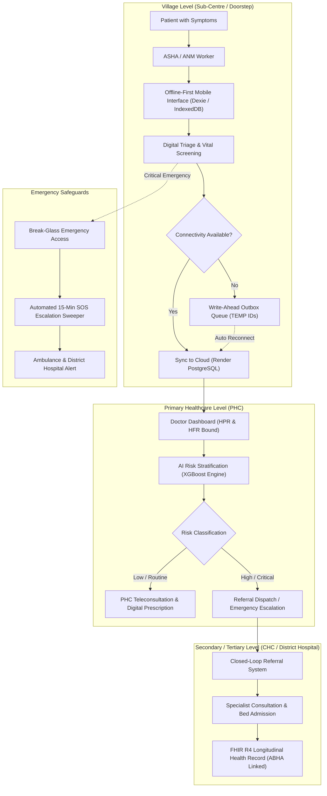

# RuralCare: Comprehensive Problem Statement Analysis & Solution Architecture

**Project:** RuralCare (Integrated Care-Access and Quality Support Solution)  
**Target:** Rural & Underserved Public Healthcare Delivery (Ayushman Bharat / NHM Compliant)  
**Date:** September 2026  

---

## Executive Summary

Rural and underserved communities face critical structural healthcare barriers:
- Long physical travel distances and financial friction.
- Acute shortages of medical specialists at primary care levels.
- Fragmented medical records across sub-centres, primary health centres (PHCs), community health centres (CHCs), and district hospitals (DH).
- Low mobile connectivity and digital/health literacy hurdles.
- Weak referral completion loops and delayed emergency escalations.

**RuralCare** does not attempt to displace or bypass the public health system. Instead, it serves as a **digital operating system for frontline health workers (ASHAs/ANMs) and PHC medical officers**. By combining **ABDM/FHIR R4 national interoperability**, **resilient offline-first synchronization**, **machine learning digital triage**, and **facility-based referral tracking**, RuralCare establishes continuous, accountable, and high-quality care from the remote village doorstep to tertiary hospitals.

---

## 1. Problem Statement Alignment & Coverage Matrix

| Problem Statement Requirement | Status | Implementation in RuralCare | Technical Component / File |
| :--- | :---: | :--- | :--- |
| **Frontline Health Worker Support** | **100% Done** | Assisted digital interface for ASHA/ANM workers; village-level patient registration, doorstep screenings, and worker directory tracking. | `WorkerDashboard.tsx` `PatientRegistration.tsx` `worker.controller.ts` |
| **Low-Connectivity / Offline Capability** | **100% Done** | Write-ahead IndexedDB offline queue; zero data loss during network blackouts; automatic background flush on reconnect with conflict recovery. | `syncEngine.ts` `offlineDb.ts` `SyncCenter.tsx` `OfflineMode.tsx` |
| **Public Health Facility Hierarchy** | **90% Done** | ABDM Health Facility Registry (`hfrId`) modeling; links doctors to PHCs, maps Sub-Centre to PHC/CHC/DH escalation, and routes referrals. | `schema.prisma` (`Facility`, `MockHFRFacility`) `AdminDashboard.tsx` `ReferralSystem.tsx` |
| **Digital Triage & High-Risk Detection** | **95% Done** | Real-time clinical vital parsing coupled with an XGBoost machine learning engine classifying patients into High, Medium, and Low risk. | `xgboostRiskEngine.ts` `HealthAssessment.tsx` `AIRiskAssessment.tsx` |
| **Longitudinal Records & ABDM Standards** | **95% Done** | Ayushman Bharat Digital Mission compliant: ABHA ID creation via Aadhaar, Healthcare Professional Registry (HPR), and FHIR R4 clinical bundles. | `fhir.service.ts` `abha.service.ts` `hpr.service.ts` `PatientMobileDashboard.tsx` |
| **Continuity of Care & Consent Management**| **100% Done** | Patient-governed consent architecture: granular doctor access requests with duration and clinical scope, patient approve/revoke controls. | `ConsentManagement.tsx` `AccessRequest.tsx` `consent.service.ts` |
| **Referral Tracking (Closed-Loop)** | **85% Done** | Inter-facility referrals with transport urgency tags, specialty requirements, reason codes, and destination facility status updates. | `ReferralSystem.tsx` `referral.controller.ts` |
| **Emergency Escalation (SOS)** | **90% Done** | Doctor "Break-Glass" emergency access with immutable audit trail; one-tap patient/worker SOS; 15-min automated escalation background sweeper. | `EmergencyAccess.tsx` `DoctorSosInbox.tsx` `sosEscalation.service.ts` |
| **Administrative & Quality Dashboards** | **85% Done** | District Health Officer (DHO) dashboard monitoring disease prevalence trends, high-risk case burdens, and cross-PHC consultation volumes. | `AdminDashboard.tsx` `DoctorDashboard.tsx` |
| **Appointment & Queue Management** | **40% Done** | Triage and referral urgency queues exist; scheduled calendar slot booking and OPD token distribution are ready for implementation. | `DoctorDashboard.tsx` `HealthAssessment.tsx` |
| **Assisted Teleconsultation** | **60% Done** | Structured clinical consultation workflows, vital trends, and digital prescriptions; real-time live WebRTC streaming simulated. | `Consultation` Model `DoctorPatientView.tsx` |
| **Medicine & Diagnostic Availability** | **50% Done** | Relational schema models for pharmacy inventory and laboratory investigations; dedicated public stock visibility UI is secondary. | `medicine.controller.ts` `schema.prisma` (`Medicine`) |

---

## 2. Architectural Flow

---

## 3. Our Innovative Take (Core Differentiators)

### 1. National Standards-First (ABDM & FHIR R4)
Rather than constructing a proprietary, isolated database, RuralCare is natively built around India's **Ayushman Bharat Digital Mission (ABDM)**:
- **ABHA (Ayushman Bharat Health Account):** Instant creation and Aadhaar verification.
- **HPR (Healthcare Professional Registry):** Doctors verified by medical registration and specialty.
- **HFR (Health Facility Registry):** Government PHCs and hospitals tracked via standardized IDs.
- **FHIR R4 Bundles:** Health records structured for national-scale portability between rural clinics and central research hospitals (e.g., AIIMS).

### 2. Cascade Offline Sync with Dependent ID Remapping
In rural field operations, network drops are common. Most applications crash when a user creates both a new patient record and an associated consultation while disconnected:
- RuralCare generates temporary client keys (`TEMP-PAT-...`).
- Buffers transactions in IndexedDB outbox tables.
- **On reconnect, it registers the patient with the server, receives the permanent Health ID, and automatically remaps all queued consultations and assessments before syncing them.**

### 3. Clinician-Assisted AI Triage (ML + Clinical Guardrails)
- Clinical decision support that combines standard physiological warning parameters (shock index, hypertensive crisis thresholds, maternal red flags) with a dedicated **XGBoost machine learning risk model** (`xgboostRiskEngine.ts`).
- Patients are categorized prior to physician consultation, optimizing doctor time in overburdened rural OPDs.

### 4. Break-Glass Emergency Protocol with Sweeper Daemon
- In acute trauma or unconscious arrivals, waiting for mobile OTP consent is fatal.
- RuralCare implements an **emergency override ("Break-Glass")** enabling instant access to patient medical histories.
- To prevent abuse, every access creates an immutable audit entry (`EmergencyAccessLog`).
- An active background daemon (`sosEscalation.service.ts`) monitors unacknowledged emergency alerts and automatically escalates them to district nodal hospitals after 15 minutes.

### 5. Frontline-Assisted Digital Interface
- Recognizes that patient-facing apps fail in areas with low digital literacy.
- ASHA workers serve as the digital bridge, handling the device while patients retain sovereign ownership of their records via ABHA QR codes and explicit consent authorization.

---

## 4. Remaining Roadmap & Enhancements

To achieve 100% feature maturity, the following modules represent the target development phases:

### Phase 1: Appointment Booking & OPD Token Queueing (Highest Priority)
- **ASHA-Assisted Booking:** Workers schedule consultations for high-risk patients with posted PHC doctors, generating verifiable OPD Token Numbers to minimize physical transit and wait times.
- **Patient Self-Booking:** Mobile app self-scheduling for smartphone owners linking directly to available doctor duty rosters.

### Phase 2: Live WebRTC Teleconsultation Calling
- Embed an adaptive, low-bandwidth video/audio streaming room into `DoctorPatientView.tsx` allowing PHC doctors to visually examine patients assisted by the ASHA worker's smartphone camera.

### Phase 3: PHC Pharmacy & Diagnostic Availability Tracker
- Dedicated inventory dashboard reflecting live essential drug stocks (e.g., ORS, Paracetamol, Metformin) and active diagnostic kit supplies across sub-centres and PHCs.

### Phase 4: Multilingual Voice Triage (Vernacular AI)
- Integration of speech-to-text engines (e.g., Bhashini / Web Speech API) to allow ASHA workers to dictate clinical notes in Hindi and regional dialects.

### Phase 5: Maternal & Child Health (MCH) Lifecycle Scheduler
- Automated longitudinal calendar generating automated alerts for Antenatal Care (ANC) visits, High-Risk Pregnancy (HRP) checkups, and national immunization milestones.

---

## 5. Summary Jury Pitch

> *"RuralCare is not another urban tele-clinic trying to bypass public infrastructure. It is a **digital operating system for India's public healthcare hierarchy**. By combining **ABDM national interoperability**, **resilient offline-first synchronization**, **machine learning digital triage**, **tiered facility routing**, and **closed-loop referral tracking**, we ensure continuity of care from the most remote village sub-centre to the district hospital—ensuring no patient is lost in transit, even in zero-connectivity environments."*

